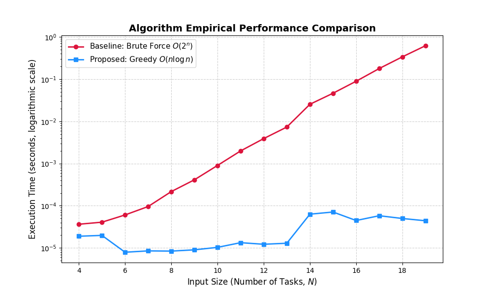

# The Source Code
```
BENCHMARK.PY HAS THE EMPIRICAL TIMING SOURCE CODE

from itertools import combinations

def baseline_solution(tasks):
    max_revenue = 0
    best_schedule = []

    for i in range(1, len(tasks) + 1):
        for subset in combinations(tasks, i):
        # Takes all combinations of the tasks from the input list and makes each a subset

            current_schedule = list(subset)
            # convert the subsets of combinations to lists
            current_schedule.sort()
            # sort them to check for deadlines easier
            is_valid = True
            current_revenue = 0

            for day, (deadline, pay) in enumerate(current_schedule, start=1):
                if day > deadline:
                    is_valid = False
                    break
                    # because the deadline was missed
                current_revenue = current_revenue + pay

            if is_valid and current_revenue > max_revenue:
                max_revenue = current_revenue
                best_schedule = current_schedule

    return max_revenue, best_schedule

client_tasks = [(2, 50), (1, 45), (2, 40), (1, 60), (3, 45), (3, 90), (4, 34), (5, 35), (3, 65), (5, 60), (1, 65), (2, 30)]
revenue, schedule = baseline_solution(client_tasks)

print(f"Max Revenue: ${revenue}")
print(f"Optimal Schedule: {schedule}")

def freelanceTasksGreedy(tasks):
    tasks = sorted(tasks, key=lambda x: x[1], reverse = True)
    max_deadline = max((deadline for deadline, _ in tasks))
    schedule = [None] * (max_deadline)
    revenue = 0
    for deadline, pay in tasks:
        for day in range(min(deadline - 1, max_deadline), -1, -1):
            if schedule[day] is None:
                schedule[day] = (deadline, pay)
                revenue += pay
                break
    return revenue, schedule

tasks = [(2, 50), (1, 45), (2, 40), (1, 60), (3, 45), (3, 90), (4, 34), (5, 35), (3, 65), (5, 60), (1, 65), (2, 30)]
print(freelanceTasksGreedy(tasks))
```

# Test Suite
To test the first error case we ran our algorithm with random, mixed deadlines and pay offs just to test that it covers a buch of numbers. Here are some example outputs (revenue, then (schedule)):
- (315, [(1, 65), (3, 65), (3, 90), (5, 35), (5, 60)])
- (397, [(1, 65), (2, 55), (3, 65), (5, 60), (5, 70), (6, 42), (7, 40)])

Then, the next case we wanted to check was if all the tasks were due on the same deadline, to make sure it simply returned the highest pay because only one of the tasks can be done on that certain day. Here is an example output:
- (90, [(1, 90)])

The next case we thought to check was simply what if there were no tasks given and therefore no schedule to make. We added a line to raise a ValueError if this case ever was to happen and this was just to make sure it actually works. Here is the output:
- raise ValueError("Task list cannot be empty.")
ValueError: Task list cannot be empty.

The final case we thought to check was if the deadlines were farther away and everything can be completed, to make sure the algorithm sorts by deadline correctly and then adds the associated pay to the revenue if so. This will also show that there was nothing done on an empty day as well, by returning None to show no money was made on that day. Here is the example: 
- (619, [None, None, None, None, None, None, None, None, None, (10, 50), (11, 45), (12, 40), (13, 60), (14, 45), (15, 90), (16, 34), (17, 35), (18, 65), (19, 60), (20, 65), (21, 30)])

# Benchmarking Test


# The Findings
The proposed algorithm that we made was an optimized greedy algorithm. It found the greatest schedule by starting from the end of the week and finding the most amount of money while being closest to the deadline. On the other hand, the baseline is naive and not optimized by making subsets and sorting from there. 
In comparing our original baseline solution to the new, more efficient solution in an empirical benchmarking test, we can see that the new solution is way faster overall. One way to immediately tell this is that the new algorithm runs in O(nlogn) and our original baseline runs in O(2^n) as upper bounds of growth. When the graph (Figure_1) was produced, there seemed to be random bumps in both lines at different points every time it was run, but because they were in different positions and of different magnitude, the concensus is that the lines were affected by background computer processes. Overall, our new algorithm proves to be much more efficient no matter the amount of inputs as the baseline only scales more and more being an exponential growth rate. 